# Welcome to SafeStep app 👋

This is an [Expo](https://expo.dev) project created with [`create-expo-app`](https://www.npmjs.com/package/create-expo-app).

## <a name="quick-start">🤸 Quick Start</a>

Follow these steps to set up the project locally on your machine.

**Prerequisites**

Make sure you have the following installed on your machine:

- [Git](https://git-scm.com/)
- [Node.js](https://nodejs.org/en)
- [npm](https://www.npmjs.com/) (Node Package Manager)

**Cloning the Repository**

```bash
git clone https://github.com/Nesrine-khbou/SafeStep.git
cd SafeStep
```

**Installation**

Install the project dependencies using npm:

```bash
npm install
```

**Set Up Environment Variables**

Create a new file named `.env` in the root of your project and add the following content:

```env
EXPO_PUBLIC_CLERK_PUBLISHABLE_KEY=
DATABASE_URL=

EXPO_PUBLIC_SERVER_URL=

EXPO_PUBLIC_GEOAPIFY_API_KEY=
EXPO_PUBLIC_GOOGLE_API_KEY=
```
Replace the placeholder values with your actual Clerk, Stripe, NeonDB, Google Maps, andgeoapify credentials. You can
obtain these credentials by signing up on
the [Clerk](https://clerk.com/), [NeonDB](https://neon.tech/), [Google Maps](https://console.cloud.google.com/)
and [geoapify](https://www.geoapify.com/) websites respectively.

**Running the Project**

```bash
npx expo start
```

Download the [Expo Go](https://expo.dev/go) app and Scan the QR code on your respective device to view the project.

## <a name="description">Description</a>

This mobile application is called SafeStep, developed in React Native as part of an IoT solution for a smart crutch.
this app includes :

Authentication (Sign-up, Sign-in, Sign-out): The sign-up process involves sending a verification code via email.

Home Page: This page displays the current location of the crutch on Google Maps, as well as its recent locations with their coordinates.

Data Page: It shows information related to LED activation, object proximity, and fall detection in the form of time-series graphs.

Battery Status Page: This page displays the crutch's battery status (low, good, full / charging, not charging).

Profile Page: It shows the user's information.

In the continuous integration part, I also developed some unit tests for the mobile app, which have been integrated into a continuous integration pipeline using Jenkins.

## <a name="screenshots">Screenshots</a>

<p align="center">
  
  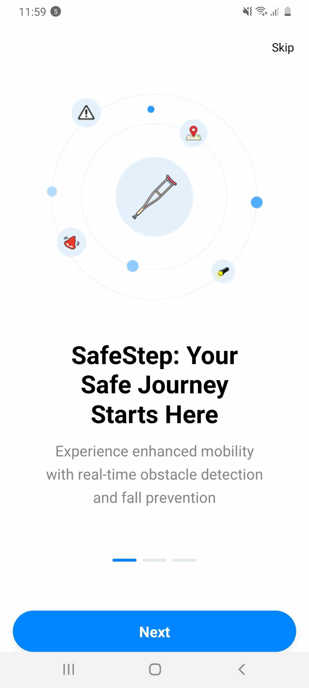
  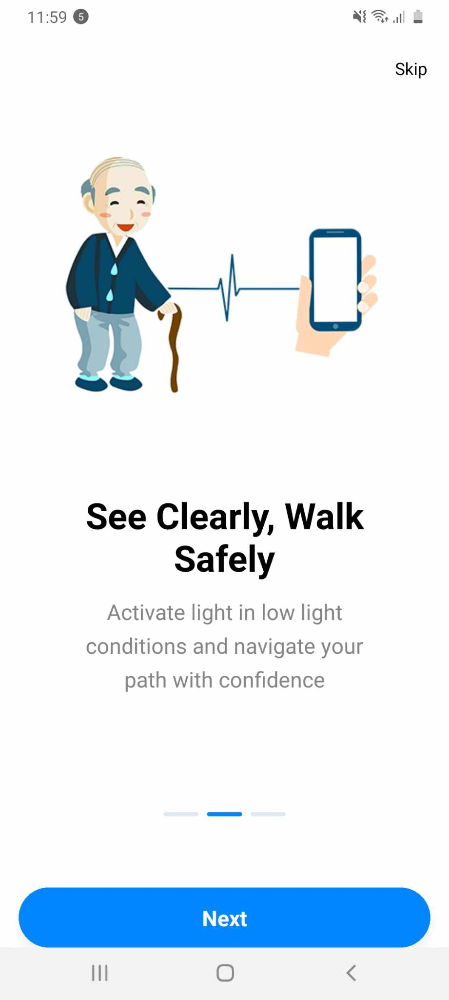
</p>

<p align="center">
  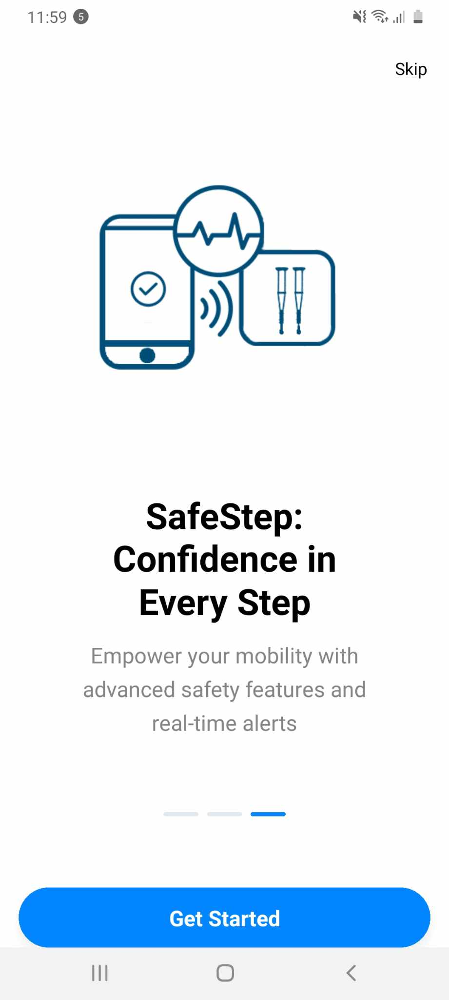
  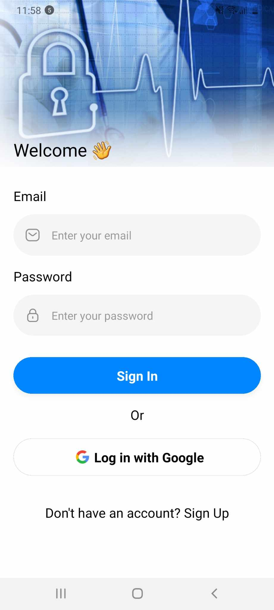
  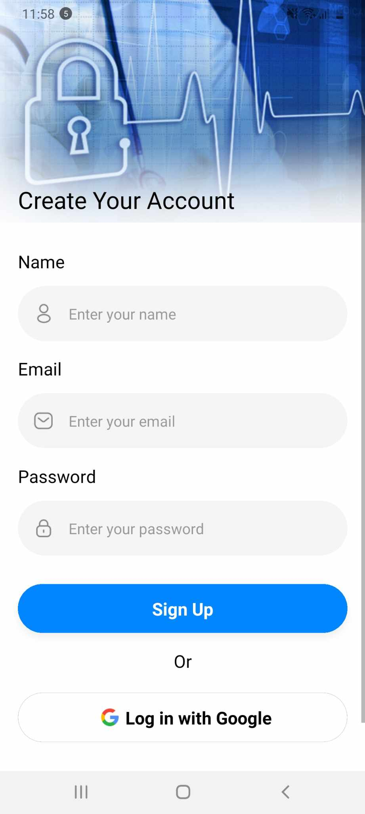
</p>

<p align="center">
  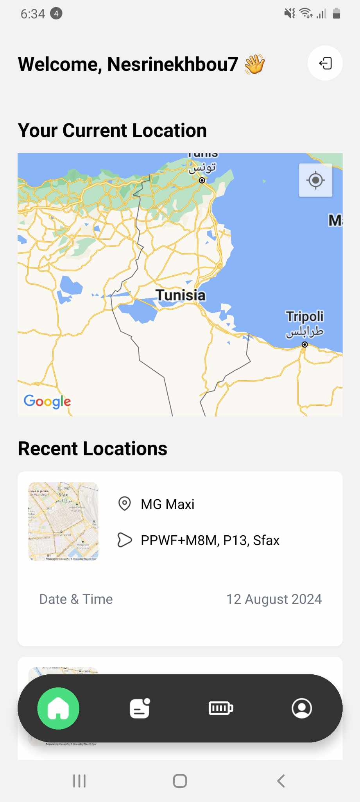
  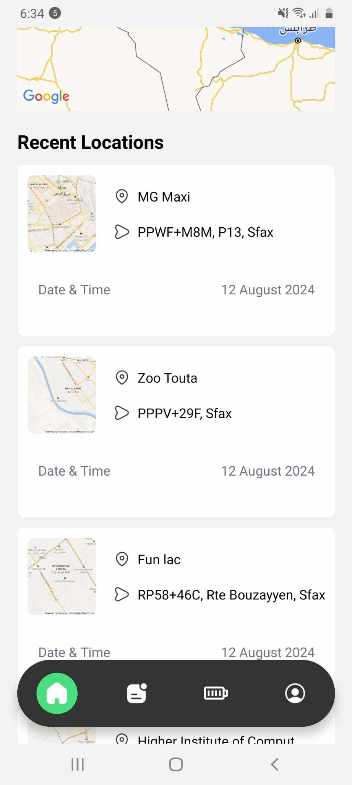
  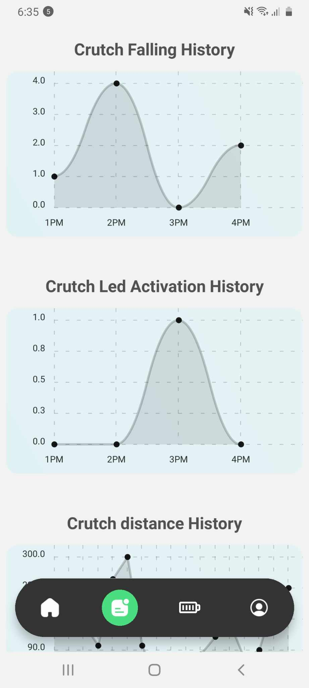
</p>

<p align="center">
  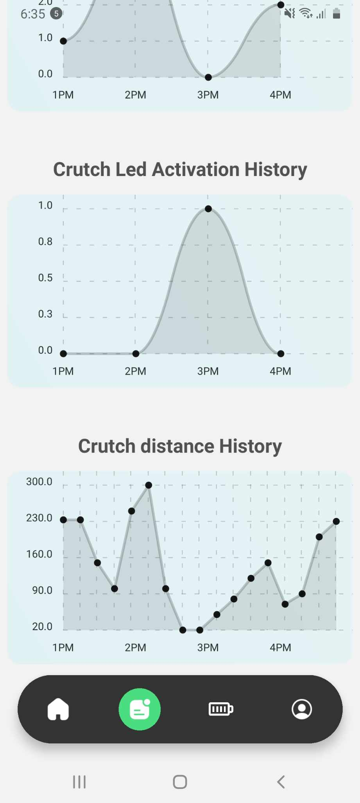
  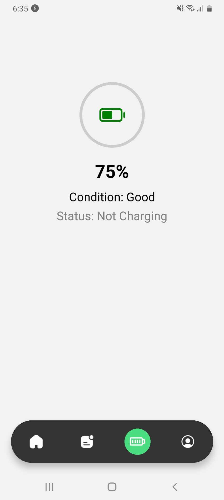
  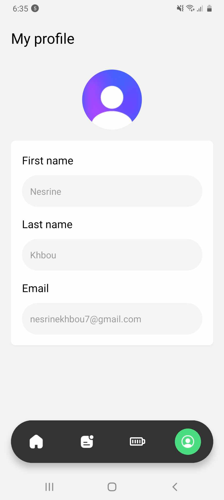
</p>


